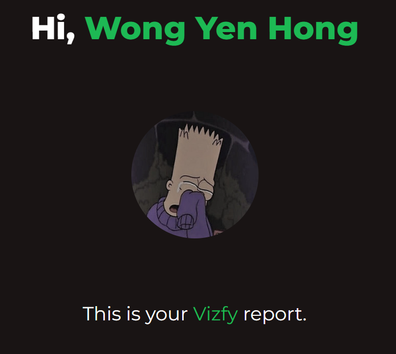

# Vizfy

This is my Hackerspace's Hackathon project. It visualizes data from Spotify.

## Live Demo

[Vizfy](https://vizfy.netlify.app/) 
 

*The API is currently under development mode which means it will not work for anyone who isn't granted with the acess, you can run this application locally with your spotify client ID, the API will work for the account that you used, or just enjoy the screenshots : (.*

## About

This web app was built using [React](https://github.com/facebook/react) and utilizes the [Spotify Web API](https://developer.spotify.com/documentation/web-api) to obtain the necessary data for visualization. Additionally, a loading screen animation implemented with the [react-spinner](https://github.com/davidhu2000/react-spinners) library.

## Running the Web Application Locally

To launch the web application, it is necessary to have <a href="http://nodejs.org/" target="_blank">Node.js</a> and <a href="https://npmjs.com/" target="_blank">npm</a> installed on your system.

Once you have installed them: 

1. Clone this repository to your local machine with:

	`$ git clone https://github.com/wyhong3103/vizfy.git`

2. Change directory to the cloned repository with:

	`$ cd vizfy`

3. Install the dependencies with:

	`$ npm i`

4. Change the `siteURL` variable in `./src/pages/siteURL.js` to `localhost:{PORT}`:

	`export const siteURL = "localhost:3000";`

5. Log into [Spotify for Developers](https://developer.spotify.com/), create an application in the dashboard, make sure you put the redirect URI as the url you had in the previous step.

6. Put your spotify client ID under `./.env` file as:

	`REACT_APP_CLIENT_ID = {CLIENT_ID}`

7. Start a development server with:

	`$ npm start`

## Screenshots :(

### Home

### The Amazing Loading Screen

### Report Page

